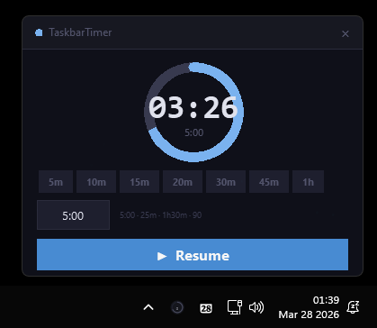

# ⏱ TaskbarTimer


> A modern, minimal countdown timer with **system tray controls** and a **floating always-on-top UI** — designed for focus and productivity.

---

## 📖 Overview

**TaskbarTimer** is a lightweight desktop timer built for Windows users who want quick, distraction-free time tracking without opening bulky apps.

It combines:
- A **floating, frameless timer window**
- A **live-updating system tray icon**
- **Quick controls** accessible anywhere

Perfect for:
- 🍅 Pomodoro sessions  
- 📚 Studying  
- 💻 Deep work  
- 🏋️ Workouts  
- ⏳ Time blocking  

---

## ✨ Features

### 🎯 Core Functionality
- ⏱ Countdown timer with second-level precision  
- 🔄 Circular progress ring visualization  
- 🧠 Smart state handling (pause, resume, reset, restart)  

### 🖥️ UI/UX
- Frameless, **always-on-top floating window**  
- Clean dark-themed interface  
- Draggable anywhere on screen  
- Minimal and distraction-free  

### ⚡ Speed & Input
- Quick presets: **5m / 10m / 25m / 1h**  
- Flexible input parsing:
  - `5:00`
  - `25m`
  - `1h30m`
  - `90` (minutes)

### 📌 System Tray Integration
- Live countdown displayed in tray tooltip  
- Dynamic tray icon with progress visualization  
- Right-click menu:
  - Show Timer  
  - Quick Start (5 / 10 / 25 min)  
  - Pause / Resume  
  - Reset  
  - Quit  

### 🔔 Notifications
- Audible alarm when timer completes  
- Visual “DONE” state  

---

## 🖼️ Screenshots (Optional)


---

## 📦 Installation

### ⚡ Option 1 — Download Executable (Recommended)

1. Go to the **Releases** section  
2. Download the latest `.zip`  
3. Extract the files  
4. Run:

✅ No Python required  
✅ Ready to use instantly  

---

### 🔧 Option 2 — Run from Source

#### 1. Clone the repository
```bash
git clone https://github.com/Aatman1/TaskbarTimer.git
cd taskbartimer
```

#### 2. Build
```bash
pip install pyinstaller
```
#### 3. Output
```bash
/dist/TaskbarTimer.exe
```

## 🚀 Usage Guide

### ▶ Starting a Timer
- Enter a time (e.g., `25m`, `5:00`)
- Press **▶ Start**

### ⏸ Controls
- Pause → `⏸`
- Resume → `▶`
- Reset → `↺`

### 🖱 System Tray
- Click tray icon → open timer  
- Right-click → quick actions  

---

## 🧠 Input Format Reference

| Input      | Meaning        |
|-----------|---------------|
| `5:00`     | 5 minutes      |
| `25m`      | 25 minutes     |
| `1h`       | 1 hour         |
| `1h30m`    | 1.5 hours      |
| `90`       | 90 minutes     |
| `45s`      | 45 seconds     |

---

## 🏗️ Project Structure
```
taskbartimer/
│
├── timer_app.py # Main application
├── assets/ # Icons / screenshots (optional)
├── README.md
└── requirements.txt
```